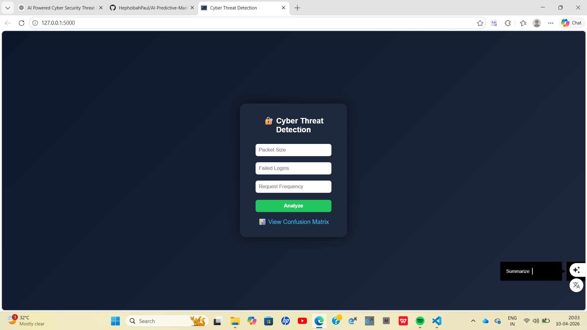
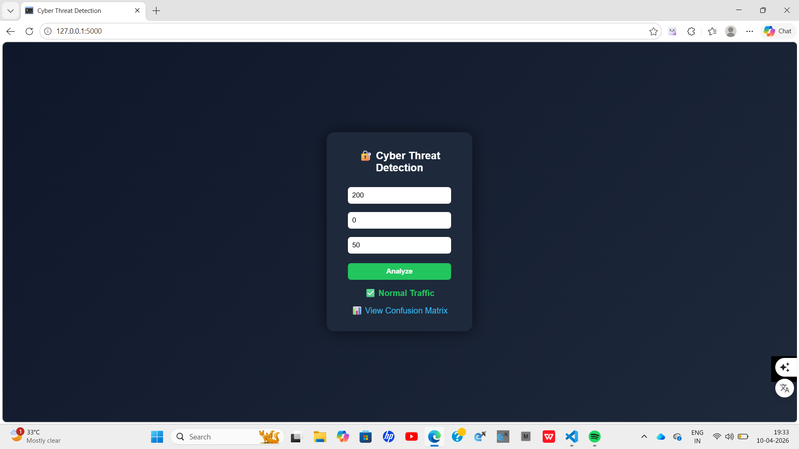

# 🔐 AI-Powered Cybersecurity Threat Detection with Real-Time Dashboard

## 📌 Overview
This project is an AI-based cybersecurity system that detects and classifies network behavior into:

- ✅ Normal Traffic  
- 🚨 Known Attacks  
- ⚠️ Anomalies  

It simulates real-world cybersecurity monitoring using machine learning models and a web-based dashboard.

---

## 🎯 Problem Statement
Traditional cybersecurity systems rely on static rules and fail to detect evolving threats.

This project solves that by:
- Using Machine Learning for intelligent detection  
- Identifying both known attacks and unknown anomalies  
- Providing real-time predictions via a web interface  

---

## 🏭 Industry Relevance
Such systems are widely used in:

- 🏦 Banking (fraud detection)  
- 💻 IT companies (intrusion detection)  
- 🌐 Network monitoring systems  
- 🛡️ Security Operations Centers (SOC)  

Companies like Google, Microsoft, and IBM Security use similar AI-based systems.

---

## ⚙️ Tech Stack

- **Programming:** Python  
- **Libraries:** Pandas, NumPy, Scikit-learn  
- **Visualization:** Matplotlib, Seaborn  
- **Backend:** Flask  
- **Model Types:** Random Forest, Isolation Forest  
- **Frontend:** HTML + CSS (Flask-based UI)  

---

## 🧠 System Architecture
User Input (Dashboard)
↓
Flask Backend (API)
↓
Preprocessing & Scaling
↓
| Random Forest (Attack) |
| Isolation Forest (Anomaly) |
    ↓

Prediction Output
↓
Dashboard Display


---

## 🔄 Workflow

1. Data Simulation (Synthetic network traffic)
2. Data Preprocessing
3. Feature Engineering
4. Model Training
5. Prediction
6. Alert Generation
7. Visualization (Confusion Matrix)

---

## 📂 Project Structure


AI-Cybersecurity-Threat-Detection/
│
├── data/
├── src/
│ ├── preprocessing.py
│ ├── train_model.py
│ ├── predict.py
│ ├── visualize.py
│
├── models/
├── outputs/
├── images/
├── app.py
├── main.py
├── requirements.txt
└── README.md

---

## ⚙️ Installation & Setup

### 1. Clone Repository
```bash
git clone <your-repo-link>
cd AI-Cybersecurity-Threat-Detection

2. Create Virtual Environment
python -m venv venv
3. Activate Environment
venv\Scripts\activate   # Windows

4. Install Dependencies
pip install -r requirements.txt

▶️ How to Run
Step 1: Train Model
python main.py
Step 2: Run Application
python app.py
Step 3: Open Browser
http://127.0.0.1:5000/

🧪 Sample Inputs
Type	Packet Size	Failed Logins	Request Frequency
Normal	200	0	50
Attack	800	7	400
Anomaly	1500	2	900

📊 Results
High accuracy on simulated data
Clear classification of traffic types
Confusion matrix visualization available

## 📸 Output Screenshots

### 🖥️ Dashboard


### ✅ Normal Traffic


### 🚨 Known Attack


### ⚠️ Anomaly Detected


🖥️ Features
Real-time threat detection
Interactive dashboard UI
API endpoint for predictions
Visualization of model performance

🧠 Learning Outcomes
Applied Machine Learning in cybersecurity
Built end-to-end ML pipeline
Integrated ML with Flask API
Designed a real-time detection system
Understood anomaly detection techniques

🚀 Future Improvements
Use real-world datasets (CICIDS, UNSW-NB15)
Deploy on cloud (AWS / Azure)
Add real-time streaming data
Enhance UI with React or Streamlit
Integrate with SIEM tools

👨‍💻 Author

M S Hephzibah Paul

⭐ Conclusion

This project demonstrates how AI can be used to build intelligent cybersecurity systems capable of detecting threats dynamically, making it highly relevant for real-world applications and industry use cases.